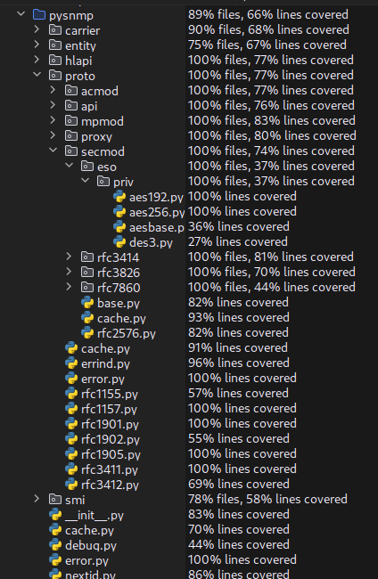
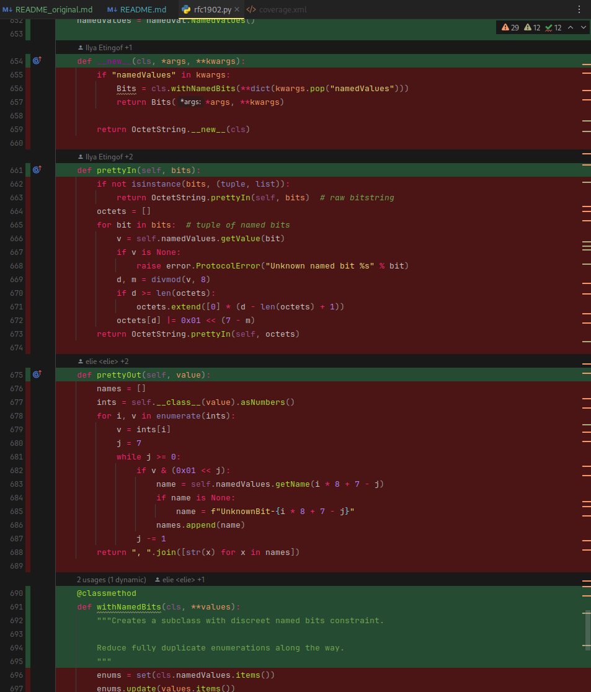
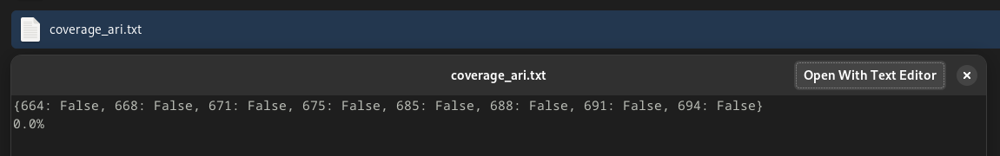
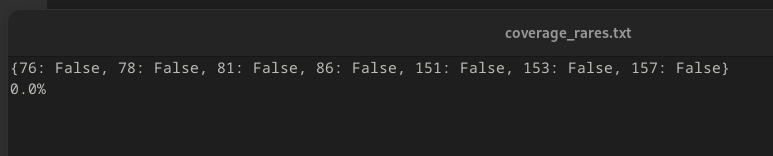
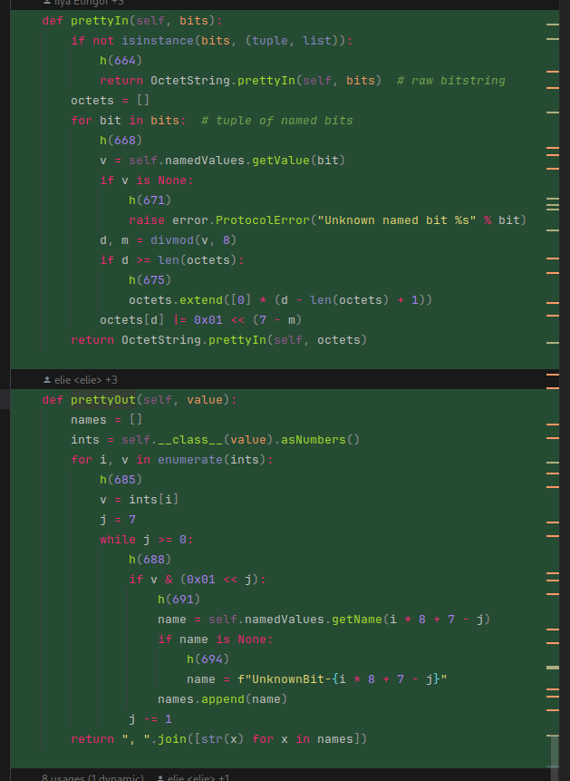
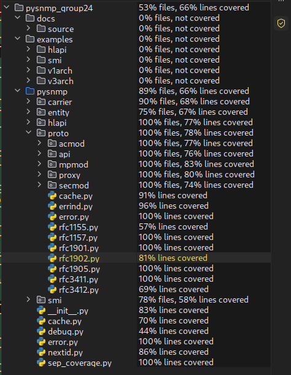
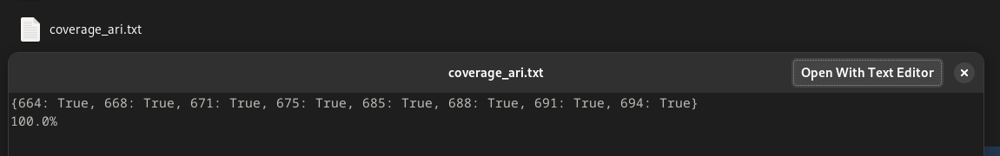
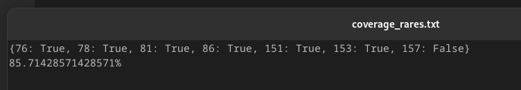
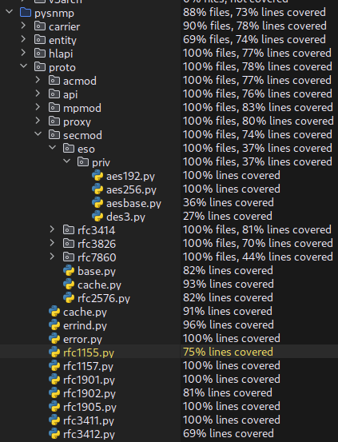

# Report for Assignment 1

## Project chosen

Name: pysnmp

URL: https://github.com/lextudio/pysnmp

Number of lines of code and the tool used to count it: 24961 (`lizard pysnmp`)

Programming language: Python

## Coverage measurement

### Existing tool

`coverage.py` + `pytest-cov` was used for coverage

```bash
poetry run pytest --cov=pysnmp --cov-report=xml:coverage.xml
```

#### Overview


#### Functions - Ari




#### Functions - Rares

`NetworkAddress.clone()`: [pysnmp/proto/rfc1155.py](pysnmp/proto/rfc1155.py)

`TypeCoercionHackMixIn._verifyComponent()`: [pysnmp/proto/rfc1155.py](pysnmp/proto/rfc1155.py)


### Your own coverage tool

[//]: # (<The following is supposed to be repeated for each group member>)

#### Ari Ionescu

`Bits.prettyIn()`: [pysnmp/proto/rfc1902.py](pysnmp/proto/rfc1902.py)

`Bits.prettyOut()`: [pysnmp/proto/rfc1902.py](pysnmp/proto/rfc1902.py)

Link to commit: 43798f4e



IDs represent lines where the instrumentation was added.

IDs 664 - 675: `Bits.prettyIn()`
IDs 685 - 694: `Bits.prettyOut()`

#### Rares David

Link to commit: 9a715db6



IDs represent lines where the instrumentation was added from `rfc1155.py`.

## Coverage improvement

### Individual tests

[//]: # (<The following is supposed to be repeated for each group member>)

#### Ari Ionescu

##### Test 1

Both sets of tests are in commit 293cd1aa.

###### Before

`coverage.py`:


Own tool:


###### After

`coverage.py`:




Own tool:



Coverage improvement was from 0% to 100% branch coverage for both functions, as the different tests exercies all 
tested cases.


#### Rares David

##### Tests

Both tests are in commit 9a715db6.

###### Before


###### After




Coverage improvement is from 0% to 85%. One branch is not reached since we couldn't figure out how to trigger that 
exact scenario, or if it's even possible.


### Overall

###### Before


###### After




Overall improvement of 66% -> 73% line coverage.

## Statement of individual contributions

### Ari Ionescu

Coverage tool
2 functions instrumented + tested

### Rares David

Repo fork + project setup
2 functions instrumented + tested
